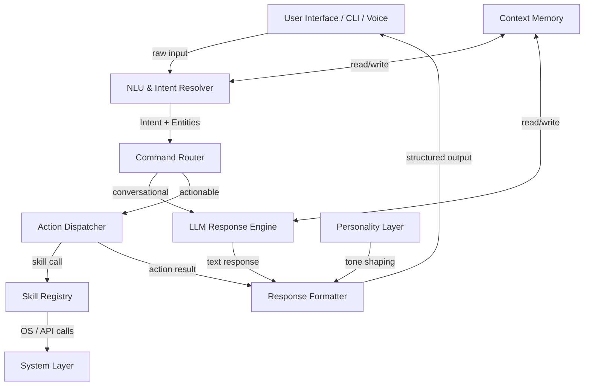
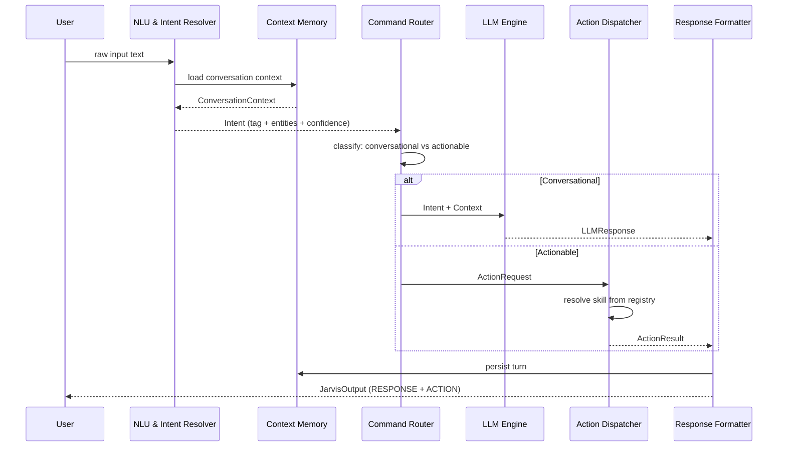
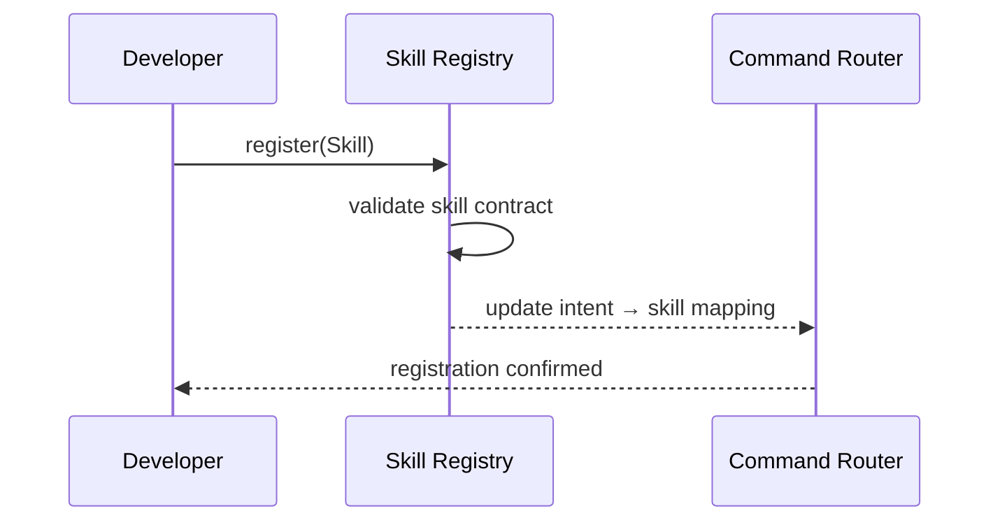

# Design Document: JARVIS AI Assistant

## Overview

JARVIS is a highly advanced personal AI assistant inspired by Iron Man's AI, designed to be a calm, confident, and intelligent companion for coding, task management, decision-making, and computer automation. It combines a natural language understanding layer with a structured command dispatch system, enabling it to respond conversationally while also executing real system actions — all with a personality that is formal yet approachable, precise, and never verbose.

The system is built around three core pillars: **Intent Resolution** (understanding what the user wants), **Action Dispatch** (executing system-level commands when applicable), and **Context Memory** (maintaining conversation state to adapt responses proactively). Every interaction produces a structured output separating the user-facing response from any executable action, ensuring clarity between what JARVIS says and what it does.

The architecture is modular and extensible — new capabilities (skills) can be registered without modifying the core pipeline. The Lean type system is used to formally specify the core data structures and invariants, ensuring correctness properties are verifiable at the type level.

---

## Architecture



---

## Sequence Diagrams

### Main Interaction Flow



### Skill Registration Flow



---

## Components and Interfaces

### Component 1: NLU & Intent Resolver

**Purpose**: Parses raw user input into a structured `Intent`, extracting the action tag, named entities, and a confidence score. Loads and updates conversation context.

**Interface**:
```lean
structure Intent where
  tag        : String          -- e.g. "open_app", "create_reminder", "explain_concept"
  entities   : List (String × String)  -- key-value pairs, e.g. [("app", "chrome")]
  confidence : Float           -- 0.0 to 1.0
  rawInput   : String

def resolveIntent (input : String) (ctx : ConversationContext) : IO Intent
```

**Responsibilities**:
- Tokenize and classify user input
- Extract named entities (app names, dates, file paths, topics)
- Assign confidence score; flag low-confidence intents for clarification
- Inject context from memory to disambiguate pronouns and references

---

### Component 2: Command Router

**Purpose**: Decides whether an intent should be handled conversationally by the LLM or dispatched as a system action.

**Interface**:
```lean
inductive RouteDecision where
  | Conversational : RouteDecision
  | Actionable     : RouteDecision

def route (intent : Intent) : RouteDecision
```

**Responsibilities**:
- Maintain a registry of actionable intent tags
- Route low-confidence intents to LLM for clarification
- Ensure actionable intents have required entities before dispatch

---

### Component 3: LLM Response Engine

**Purpose**: Generates natural language responses for conversational intents, applying JARVIS personality constraints.

**Interface**:
```lean
structure LLMResponse where
  text        : String
  suggestions : List String   -- proactive suggestions JARVIS may offer

def generateResponse (intent : Intent) (ctx : ConversationContext) : IO LLMResponse
```

**Responsibilities**:
- Apply personality layer (formal, concise, confident, light wit)
- Never use self-deprecating phrases ("I'm just an AI")
- Offer proactive suggestions when relevant
- Break complex answers into numbered steps when appropriate

---

### Component 4: Action Dispatcher

**Purpose**: Resolves the correct skill from the registry and executes it, returning a structured result.

**Interface**:
```lean
structure ActionRequest where
  skillId  : String
  params   : List (String × String)

inductive ActionResult where
  | Success : String → ActionResult   -- human-readable confirmation
  | Failure : String → ActionResult   -- human-readable error

def dispatch (req : ActionRequest) (registry : SkillRegistry) : IO ActionResult
```

**Responsibilities**:
- Look up skill by `skillId`; return `Failure` if not found
- Pass validated params to skill executor
- Catch and wrap system-level errors gracefully

---

### Component 5: Skill Registry

**Purpose**: Stores all registered skills and their metadata, enabling dynamic capability extension.

**Interface**:
```lean
structure Skill where
  id          : String
  description : String
  intentTags  : List String
  requiredParams : List String
  execute     : List (String × String) → IO ActionResult

structure SkillRegistry where
  skills : List Skill

def register   (skill : Skill)  (reg : SkillRegistry) : SkillRegistry
def lookupById (id : String)    (reg : SkillRegistry) : Option Skill
def lookupByTag (tag : String)  (reg : SkillRegistry) : List Skill
```

**Responsibilities**:
- Enforce unique skill IDs
- Validate required params at registration time
- Support lookup by both ID and intent tag

---

### Component 6: Context Memory

**Purpose**: Maintains a rolling window of conversation turns, enabling JARVIS to reference prior instructions and adapt responses.

**Interface**:
```lean
structure Turn where
  role    : String   -- "user" | "jarvis"
  content : String
  ts      : Nat      -- Unix timestamp

structure ConversationContext where
  turns    : List Turn
  maxTurns : Nat     -- rolling window size

def addTurn    (turn : Turn) (ctx : ConversationContext) : ConversationContext
def getContext (ctx : ConversationContext) : List Turn   -- returns last maxTurns
```

**Responsibilities**:
- Enforce rolling window (drop oldest turns beyond `maxTurns`)
- Persist context across sessions (file or DB backend)
- Provide ordered turn history for LLM prompt construction

---

### Component 7: Response Formatter

**Purpose**: Assembles the final `JarvisOutput`, combining the LLM response or action result with the JARVIS output format.

**Interface**:
```lean
structure JarvisOutput where
  response : String          -- what JARVIS says to the user
  action   : Option String   -- system command string, if applicable

def format (llmResp : Option LLMResponse) (actResult : Option ActionResult) : JarvisOutput
```

**Responsibilities**:
- Produce `RESPONSE: <text> / ACTION: <command>` format when action is present
- Omit `ACTION` field for purely conversational outputs
- Apply final personality tone check

---

## Data Models

### Model: JarvisConfig

```lean
structure JarvisConfig where
  personalityMode : String    -- "formal" | "casual" (default: "formal")
  maxContextTurns : Nat       -- rolling memory window (default: 20)
  llmModel        : String    -- e.g. "gpt-4o"
  verboseMode     : Bool      -- default: false
  proactiveSuggestions : Bool -- default: true
```

**Validation Rules**:
- `maxContextTurns` must be > 0
- `llmModel` must be a non-empty string
- `personalityMode` must be one of the allowed variants

---

### Model: Intent

```lean
structure Intent where
  tag        : String
  entities   : List (String × String)
  confidence : Float
  rawInput   : String
```

**Validation Rules**:
- `tag` must be non-empty
- `confidence` ∈ [0.0, 1.0]
- `rawInput` must be non-empty

---

### Model: JarvisOutput

```lean
structure JarvisOutput where
  response : String
  action   : Option String
```

**Validation Rules**:
- `response` must be non-empty
- `action`, when present, must be a non-empty executable command string

---

## Algorithmic Pseudocode

### Main Processing Algorithm

```math
\begin{aligned}
&\textbf{Algorithm: processInput}\\
&\textbf{Require: } \text{input} \neq \emptyset,\ \text{ctx} \in \text{ConversationContext}\\
&\textbf{Ensure: } \text{out} \in \text{JarvisOutput where out.response} \neq \emptyset\\
&\\
&\quad \text{intent} \gets \text{resolveIntent}(\text{input}, \text{ctx})\\
&\quad \textbf{if } \text{intent.confidence} < 0.5 \textbf{ then}\\
&\quad\quad \textbf{return } \text{JarvisOutput}\{\text{response}: \text{askClarification}(\text{intent}),\ \text{action}: \emptyset\}\\
&\quad \textbf{end if}\\
&\\
&\quad \textbf{match } \text{route}(\text{intent}) \textbf{ with}\\
&\quad | \text{Conversational} \rightarrow\\
&\quad\quad \text{llmResp} \gets \text{generateResponse}(\text{intent}, \text{ctx})\\
&\quad\quad \textbf{return } \text{format}(\text{Some}(\text{llmResp}), \emptyset)\\
&\quad | \text{Actionable} \rightarrow\\
&\quad\quad \text{req} \gets \text{buildActionRequest}(\text{intent})\\
&\quad\quad \text{result} \gets \text{dispatch}(\text{req}, \text{registry})\\
&\quad\quad \textbf{return } \text{format}(\emptyset, \text{Some}(\text{result}))
\end{aligned}
```

**Preconditions**:
- `input` is a non-empty string
- `ctx` is a valid `ConversationContext`
- `registry` is initialized with at least the built-in skills

**Postconditions**:
- `out.response` is always non-empty
- `out.action` is `Some(cmd)` only when an actionable intent was dispatched
- The turn is persisted to `ctx` after output is produced

**Loop Invariants**: N/A (no loops in main dispatch path)

---

### Skill Dispatch Algorithm

```math
\begin{aligned}
&\textbf{Algorithm: dispatch}\\
&\textbf{Require: } \text{req.skillId} \neq \emptyset,\ \text{registry} \neq \emptyset\\
&\textbf{Ensure: } \text{result} \in \text{ActionResult}\\
&\\
&\quad \text{skill} \gets \text{lookupById}(\text{req.skillId}, \text{registry})\\
&\quad \textbf{if } \text{skill} = \emptyset \textbf{ then}\\
&\quad\quad \textbf{return } \text{ActionResult.Failure}(\text{"Skill not found: "} \oplus \text{req.skillId})\\
&\quad \textbf{end if}\\
&\\
&\quad \text{missing} \gets \text{skill.requiredParams} \setminus \text{keys}(\text{req.params})\\
&\quad \textbf{if } \text{missing} \neq \emptyset \textbf{ then}\\
&\quad\quad \textbf{return } \text{ActionResult.Failure}(\text{"Missing params: "} \oplus \text{show}(\text{missing}))\\
&\quad \textbf{end if}\\
&\\
&\quad \textbf{try}\\
&\quad\quad \textbf{return } \text{skill.execute}(\text{req.params})\\
&\quad \textbf{catch } e\\
&\quad\quad \textbf{return } \text{ActionResult.Failure}(\text{show}(e))
\end{aligned}
```

**Preconditions**:
- `req.skillId` is non-empty
- `registry` has been initialized

**Postconditions**:
- Always returns an `ActionResult` (never throws)
- `Failure` result contains a human-readable message

---

## Key Functions with Formal Specifications

### `resolveIntent`

```lean
def resolveIntent (input : String) (ctx : ConversationContext) : IO Intent
```

**Preconditions**:
- `input.length > 0`
- `ctx` is a valid `ConversationContext`

**Postconditions**:
- Returns `Intent` with `tag.length > 0`
- `confidence ∈ [0.0, 1.0]`
- `rawInput = input`

**Loop Invariants**: N/A

---

### `route`

```lean
def route (intent : Intent) : RouteDecision
```

**Preconditions**:
- `intent.tag.length > 0`
- `intent.confidence ∈ [0.0, 1.0]`

**Postconditions**:
- Returns `Actionable` iff `intent.tag ∈ actionableTagRegistry`
- Returns `Conversational` otherwise
- Pure function — no side effects

---

### `addTurn`

```lean
def addTurn (turn : Turn) (ctx : ConversationContext) : ConversationContext
```

**Preconditions**:
- `turn.content.length > 0`
- `turn.role ∈ ["user", "jarvis"]`

**Postconditions**:
- Result context contains `turn` as the most recent entry
- `result.turns.length ≤ ctx.maxTurns` (oldest turns dropped if over limit)
- `ctx.maxTurns` is unchanged

**Loop Invariants**: N/A

---

### `format`

```lean
def format (llmResp : Option LLMResponse) (actResult : Option ActionResult) : JarvisOutput
```

**Preconditions**:
- At least one of `llmResp` or `actResult` is `Some`

**Postconditions**:
- `result.response.length > 0`
- `result.action = Some(cmd)` only when `actResult = Some(ActionResult.Success(cmd))`
- Pure function — no side effects

---

## Example Usage

```lean
-- Example 1: Conversational query
def exampleConversational : IO Unit := do
  let ctx := { turns := [], maxTurns := 20 }
  let out ← processInput "Explain how quicksort works" ctx
  -- out.response = "Quicksort is a divide-and-conquer algorithm..."
  -- out.action   = none
  IO.println s!"RESPONSE: {out.response}"

-- Example 2: Actionable command
def exampleActionable : IO Unit := do
  let ctx := { turns := [], maxTurns := 20 }
  let out ← processInput "open chrome" ctx
  -- out.response = "Opening Chrome for you."
  -- out.action   = some "open -a 'Google Chrome'"
  IO.println s!"RESPONSE: {out.response}"
  match out.action with
  | some cmd => IO.println s!"ACTION: {cmd}"
  | none     => pure ()

-- Example 3: Low-confidence → clarification
def exampleClarification : IO Unit := do
  let ctx := { turns := [], maxTurns := 20 }
  let out ← processInput "do the thing" ctx
  -- out.response = "Could you clarify what you'd like me to do?"
  -- out.action   = none
  IO.println s!"RESPONSE: {out.response}"

-- Example 4: Skill registration
def exampleSkillRegistration : IO Unit := do
  let mySkill : Skill := {
    id             := "open_app",
    description    := "Opens a named application",
    intentTags     := ["open_app"],
    requiredParams := ["app"],
    execute        := fun params => do
      let app := params.lookup "app" |>.getD "unknown"
      return ActionResult.Success s!"open -a '{app}'"
  }
  let registry := register mySkill emptyRegistry
  IO.println "Skill registered."
```

---

## Correctness Properties

*A property is a characteristic or behavior that should hold true across all valid executions of a system — essentially, a formal statement about what the system should do. Properties serve as the bridge between human-readable specifications and machine-verifiable correctness guarantees.*

### Property 1: processInput always produces a non-empty response

*For any* non-empty input string and valid ConversationContext, the System SHALL produce a JarvisOutput whose response field is non-empty.

**Validates: Requirements 8.1**

### Property 2: Low-confidence intents never produce actions

*For any* Intent with a confidence score below 0.5, the System SHALL produce a JarvisOutput with action set to None.

**Validates: Requirements 1.3, 8.4**

### Property 3: addTurn preserves rolling window bound

*For any* Turn and ConversationContext, after calling addTurn the resulting context's turn count SHALL be less than or equal to maxTurns.

**Validates: Requirements 6.1, 6.5**

### Property 4: route is deterministic and pure

*For any* Intent, calling route on the same Intent SHALL always return the same RouteDecision with no side effects.

**Validates: Requirements 2.4**

### Property 5: dispatch always returns an ActionResult (never throws)

*For any* ActionRequest and SkillRegistry, dispatch SHALL always return an ActionResult and SHALL NOT propagate exceptions to the caller.

**Validates: Requirements 4.5**

### Property 6: Skill lookup by ID is consistent with registration

*For any* Skill and SkillRegistry, after registering the Skill, looking it up by its ID SHALL return that same Skill.

**Validates: Requirements 5.1**

### Property 7: Actionable intents produce action output

*For any* actionable Intent that dispatches successfully, the System SHALL set the JarvisOutput action field to the command string returned by the Skill.

**Validates: Requirements 8.2**

### Property 8: Conversational intents produce no action output

*For any* conversational Intent, the System SHALL set the JarvisOutput action field to None.

**Validates: Requirements 8.3**

### Property 9: Skill lookup by tag is consistent with registration

*For any* Skill and SkillRegistry, after registering the Skill, looking up by any of its declared intent tags SHALL include that Skill in the results.

**Validates: Requirements 5.2**

### Property 10: Intent rawInput preservation

*For any* non-empty input string, the Intent produced by resolveIntent SHALL have its rawInput field equal to the original input string.

**Validates: Requirements 1.1**

---

## Error Handling

### Error Scenario 1: Low-Confidence Intent

**Condition**: `intent.confidence < 0.5` after NLU resolution
**Response**: JARVIS asks a targeted clarification question based on the partial intent tag
**Recovery**: User provides additional context; intent is re-resolved with updated input

---

### Error Scenario 2: Skill Not Found

**Condition**: `dispatch` receives a `skillId` not present in the registry
**Response**: `ActionResult.Failure("Skill not found: <id>")` → JARVIS informs user the action isn't supported
**Recovery**: Suggest the closest available skill or ask user to rephrase

---

### Error Scenario 3: Missing Required Parameters

**Condition**: Skill's `requiredParams` are not all present in `ActionRequest.params`
**Response**: `ActionResult.Failure("Missing params: <list>")` → JARVIS asks user to supply missing info
**Recovery**: Re-prompt user for the specific missing entities

---

### Error Scenario 4: System-Level Execution Failure

**Condition**: `skill.execute` throws an OS-level exception (e.g., app not installed, permission denied)
**Response**: `ActionResult.Failure(show(e))` → JARVIS reports the error clearly without technical jargon
**Recovery**: Suggest alternative action or ask user to verify system state

---

### Error Scenario 5: LLM API Failure

**Condition**: LLM engine returns an error or times out
**Response**: JARVIS responds with a graceful fallback: "I'm having trouble processing that right now. Could you try again?"
**Recovery**: Retry with exponential backoff; fall back to cached response if available

---

## Testing Strategy

### Unit Testing Approach

Each component is tested in isolation with mock dependencies:
- `resolveIntent`: test with known inputs, verify tag and entity extraction
- `route`: test all known actionable tags return `Actionable`, others return `Conversational`
- `addTurn`: verify rolling window enforcement at boundary conditions
- `format`: verify output structure for all combinations of `Some`/`None` inputs
- `dispatch`: test skill-not-found, missing-params, and successful execution paths

### Property-Based Testing Approach

**Property Test Library**: `QuickCheck` (Lean/Haskell) or `fast-check` (if JS runtime is used)

Key properties to test:
- `∀ input ≠ "" → processInput(input).response ≠ ""`
- `∀ intent with confidence < 0.5 → output.action = None`
- `∀ turn, ctx → addTurn(turn, ctx).turns.length ≤ ctx.maxTurns`
- `∀ skill, registry → lookupById(skill.id, register(skill, registry)) = Some(skill)`
- `∀ req with unknown skillId → dispatch(req) = Failure(_)`

### Integration Testing Approach

End-to-end tests covering full interaction flows:
- Conversational query → LLM response → formatted output
- Actionable command → skill dispatch → system action → formatted output
- Multi-turn conversation → context memory → context-aware response
- Skill registration → intent routing → dispatch

---

## Performance Considerations

- **Context window**: Rolling window capped at `maxContextTurns` (default 20) to bound LLM prompt size and memory usage
- **Skill lookup**: O(n) linear scan is acceptable for small registries (<100 skills); upgrade to hash map if registry grows
- **LLM latency**: Responses should stream where the LLM API supports it, to reduce perceived latency
- **Action dispatch**: System commands execute asynchronously where possible; JARVIS confirms initiation immediately rather than waiting for completion

---

## Security Considerations

- **Command injection**: All system-level commands constructed by the Action Dispatcher must sanitize entity values (e.g., app names, file paths) before passing to the OS shell
- **Privilege escalation**: Skills requiring elevated permissions must explicitly declare this and prompt the user for confirmation before execution
- **LLM prompt injection**: User input passed to the LLM must be wrapped in a structured prompt template that prevents instruction override attacks
- **Context persistence**: Stored conversation context must not include sensitive data (passwords, API keys) in plaintext; apply redaction before persistence

---

## Dependencies

| Dependency | Purpose |
|---|---|
| LLM API (e.g., OpenAI GPT-4o) | Natural language understanding and response generation |
| Lean 4 | Core type system, formal specifications, and proof assistant |
| OS shell / subprocess library | Executing system-level actions (open apps, create folders, etc.) |
| Persistent storage (file / SQLite) | Conversation context persistence across sessions |
| Property-based test library | Automated correctness verification |
